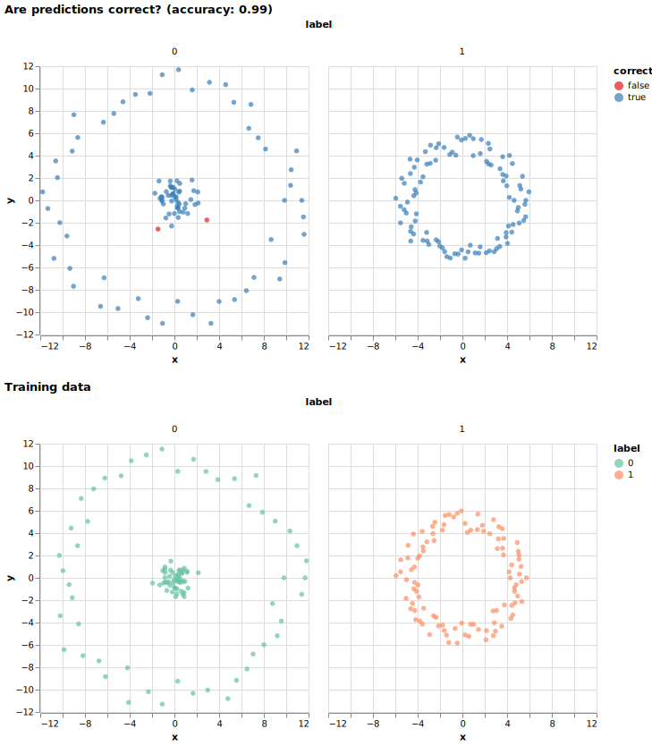

# Running your code and creating your own container

Prerequisites:
You will need Docker Engine and a Docker-Hub user to create your own containers:

[Docker Desktop](https://www.docker.com/products/docker-desktop/)

[Docker Hub](https://hub.docker.com/)

Clone your own copy of the workshop code:
```
git clone https://github.com/workshop-material/classification-task.git
```

# Dockerfile

To create a container you need to create a file called Dockerfile.
```
# Using lightweight Python image from Docker Hub as starting image
FROM python:3.12-slim
# Copy the current directory contents into the container at /app
COPY . /app
# Change the working directory
WORKDIR /app
# Install the required Python packages from requirements.txt
RUN pip install --no-cache-dir -r requirements.txt
```
# Requirements.txt
In this example we only need Python and the Python dependencies. View the individual python scripts and look at the imports at the top to find the dependencies.
Then create a requirements.txt file and add the modules there:

```
click
numpy
matplotlib
scipy
pandas
altair
vl-convert-python
```
# Building the container

When you have the Dockerfile and requirements.txt ready, and you are running Docker Engine (Docker Desktop), you can build your container by going to the folder where you have your Dockerfile and requirements.txt and typing:
```
docker build -t name-of-my-docker-image .

```
Afterwards you can upload it to DockerHub with:
```
docker tag my-docker-image my-docker-hub-name/my-docker-image:latest
```
Make sure that your docker image is pushed to DockerHub and that it is public. You might have to find it in either Docker Desktop or on the DockerHub site and push it.
To push your image to DockerHub through the terminal:
Ensure you are logged in
```
docker login
```
And push:
```
docker push yourusername/name-of-image
```

# Job script
For the job to be able to run all the Python scripts in one job, we create a bash script to execute the Python scripts one by one.
```
#!/bin/sh

# create the data directory if it does not exist
mkdir -p data

python3 generate_data.py \
        --num-samples 100 \
        --training-data data/train.csv \
        --test-data data/test.csv

python3 generate_predictions.py \
        --num-neighbors 7 \
        --training-data data/train.csv \
        --test-data data/test.csv \
        --predictions data/predictions.csv

python3 plot_results.py \
        --training-data data/train.csv \
        --predictions data/predictions.csv \
        --output-chart chart.svg
```
# Preparing to run your job

Now we are almost ready to launch the job, first we need to copy over all the scripts to the cluster:

```
scp experiment.sh generate_data.py generate_predictions.py plot_results.py springfield:~/
```

# Job spec
To run the job you need to create a job script:
```
kind: Job
apiVersion: batch/v1
metadata:
  name: name-of-my-job #Custom name for your job
spec:
  template:
    spec:
      containers:
      - name: my-container-image
        image: "dockerhub-username/my-container-image:latest"  # Replace with your Docker image
        workingDir: /storage
        command: ["sh", "experiment.sh"]  # Adjust if your script name is different
        volumeMounts:
        - name: storage
          mountPath: /storage
      volumes:
      - name: storage
        persistentVolumeClaim:
          claimName: storage
      restartPolicy: OnFailure
  backoffLimit: 0
```

# Submit the job
```
frink run job.yaml --follow
```
or if you prefer not to use frink:
```
kubectl apply -f job.yaml
```

# Results

When the job has finished you can copy back the results from Springfield:
```
scp springfield:~/chart.svg .
```
This should copy the plotted results to the folder you are in on your local machine.


